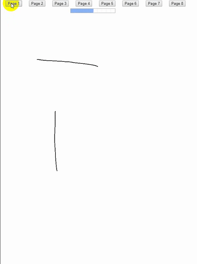

# Draw Digital Page

使用Web Canvas绘制数位板数据到网页中



## 使用方法

1. 安装必要工具
    * Git

2. 克隆代码到本地
```
git clone https://github.com/muxiaozi/draw-digital-page.git
```

3. 部署代码到服务器
4. 使用浏览器访问 `http://your-server/index.html`

## 文件解释

| 名称 | 作用 |
|------|------|
| digital.data | 数位板产生的数据文件 |
| digital.js | 用于解析数位板数据，并绘制图像的核心文件 |
| index.html | 网页界面 |